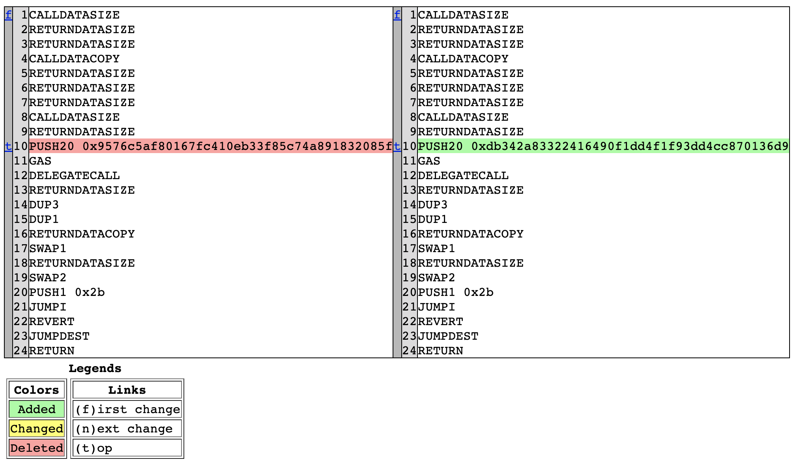

# Bytecode

## disasm

Print the EVM bytecode of the specified address in assembly format .

```
peth > disasm 0x334cbb5858417aee161b53ee0d5349ccf54514cf
CALLDATASIZE
RETURNDATASIZE
RETURNDATASIZE
CALLDATACOPY
RETURNDATASIZE
RETURNDATASIZE
RETURNDATASIZE
CALLDATASIZE
RETURNDATASIZE
PUSH20 0x9576c5af80167fc410eb33f85c74a891832085f
GAS
DELEGATECALL
RETURNDATASIZE
DUP3
DUP1
RETURNDATACOPY
SWAP1
RETURNDATASIZE
SWAP2
PUSH1 0x2b
JUMPI
REVERT
JUMPDEST
RETURN
```

## diffasm

Output the bytecode differences of two contract addresses.

```
peth > diffasm eth 0x334cbb5858417aee161b53ee0d5349ccf54514cf eth 0xEBfb47A7ad0FD6e57323C8A42B2E5A6a4F68fc1a
Written to diff/eth_0x334cbb5858417aee161b53ee0d5349ccf54514cf_eth_0xEBfb47A7ad0FD6e57323C8A42B2E5A6a4F68fc1a_0.96.html
peth > open diff/eth_0x334cbb5858417aee161b53ee0d5349ccf54514cf_eth_0xEBfb47A7ad0FD6e57323C8A42B2E5A6a4F68fc1a_0.96.html
```

As follows：



## abi4byte

Disassemble the bytecode, look for the `PUSH4` instruction, and output it as the selector. This can be very useful for identifying non-open source contracts. 

Some view methods will be automatically called and print the return values.

```
# WETH token
peth > abi4byte 0xc02aaa39b223fe8d0a0e5c4f27ead9083c756cc2
0x06fdde03 name()                string Wrapped Ether
0x095ea7b3 approve(address,uint256)               
0x18160ddd totalSupply()                 uint256 2994988845248063744615379 (0x27a36abae5e226bc5a3d3)
0x23b872dd transferFrom(address,address,uint256)                  
0x313ce567 decimals()                    uint256 18 (0x12)
0x70a08231 balanceOf(address)                     
0x95d89b41 symbol()              string WETH
0xa9059cbb transfer(address,uint256)                      
0xd0e30db0 deposit()                     bytes 0x
0xdd62ed3e allowance(address,address) 
```